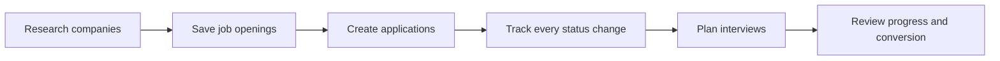
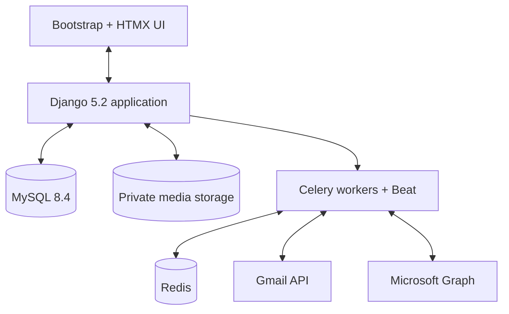
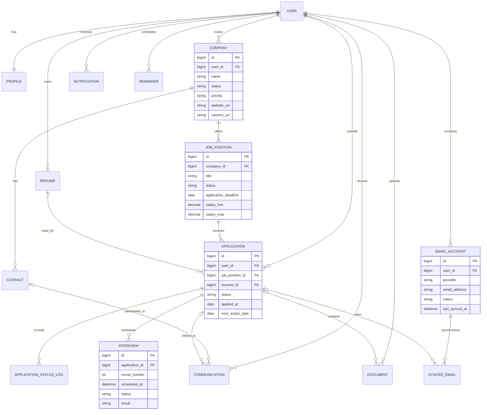

<div align="center">

# Job Tracker

### A private, self-hosted workspace for managing your entire job search

Track companies, job openings, applications, interviews, follow-ups, documents, contacts, and recruitment email—without scattering your data across spreadsheets and inboxes.

[](https://www.djangoproject.com/)
[](https://www.python.org/)
[](https://www.mysql.com/)
[](#quality-and-security)
[](#project-status)

</div>

---

## Why Job Tracker?

Most job searches quickly turn into a mix of spreadsheets, browser bookmarks, calendar events, email threads, and half-finished notes. Job Tracker brings those pieces into one structured workflow:



The application is designed for private self-hosting and small multi-user deployments. Every business query is scoped to the signed-in user, uploaded files are protected, and OAuth tokens are encrypted at rest.

## Highlights

### Application pipeline

- Kanban-style application board powered by HTMX
- Atomic status changes with a complete application timeline
- Follow-up dates, priorities, sources, salary expectations, and rejection notes
- Protection against duplicate active applications for the same role

### Companies and job openings

- Separate company, careers-page, and job-source URLs
- Company research status and priority tracking
- Structured salary, currency, work mode, employment type, and deadline fields
- Duplicate job warnings without blocking legitimate reposted positions

### Interviews and reminders

- Multi-round interview planning and retrospective notes
- Unified calendar for interviews, deadlines, and follow-ups
- In-app and email reminder infrastructure
- Celery and Redis support for scheduled processing

### Career materials and relationships

- Versioned resumes linked to the application where they were used
- Private document uploads with file type and size validation
- Recruiter, interviewer, referrer, and hiring-manager contacts
- Communication history and user-defined tags

### Gmail and Outlook integration

- OAuth connection flow—mailbox passwords are never stored
- Encrypted access and refresh tokens
- Manual and scheduled message synchronization
- Manual or suggested links between email, companies, contacts, and applications
- Send recruitment email from an application and record it in communication history

### Dashboard analytics

- Application totals and status breakdown
- Source distribution and monthly application trend
- Pipeline and offer conversion rates
- Upcoming interviews, approaching deadlines, unread notifications, and follow-ups

## Architecture



The codebase is split by responsibility:

| App | Responsibility |
| --- | --- |
| `accounts` | Custom user model, authentication, and profile preferences |
| `companies` | Companies and job openings |
| `applications` | Applications, status history, and interviews |
| `productivity` | Contacts, resumes, documents, communication, and tags |
| `core` | Dashboard, notifications, reminders, calendar, and scheduled tasks |
| `mailboxes` | OAuth accounts, synchronized email, and sending |

## Data Model



The complete field-level design, status values, ownership rules, and deletion behavior are documented in [`docs/data-model.md`](docs/data-model.md).

## Quick Start on Windows

### Requirements

- Python 3.12+
- PowerShell
- The project-local MySQL installation created during setup, or MySQL 8.0.11+
- Redis for continuously scheduled reminders and automatic mailbox sync

### Run the application

```powershell
git clone https://github.com/anous341256/job-tracker.git
cd job-tracker

python -m venv .venv
.\.venv\Scripts\python.exe -m pip install -r requirements.txt
Copy-Item .env.example .env
```

Configure the database credentials and secrets in `.env`, then run:

```powershell
.\.venv\Scripts\python.exe manage.py migrate
.\.venv\Scripts\python.exe manage.py createsuperuser
.\.venv\Scripts\python.exe manage.py runserver
```

Open [http://127.0.0.1:8000/](http://127.0.0.1:8000/). The Django administration site is available at `/admin/`.

> The local `scripts/start-mysql.ps1` helper expects a project-local MySQL binary under `.local/`. That directory is intentionally not committed. A fresh clone can instead point `.env` at any supported MySQL server.

## Email Verification

Development defaults to Django's console email backend. Verification and password-reset links are printed in the terminal running `runserver`; no real message is delivered.

For real delivery, configure the SMTP variables in `.env`:

```dotenv
EMAIL_BACKEND=django.core.mail.backends.smtp.EmailBackend
EMAIL_HOST=smtp.example.com
EMAIL_PORT=587
EMAIL_HOST_USER=your-user
EMAIL_HOST_PASSWORD=your-app-password
EMAIL_USE_TLS=True
DEFAULT_FROM_EMAIL=Job Tracker <noreply@example.com>
```

## Gmail and Outlook OAuth

Register OAuth applications and configure these callback URLs:

```text
http://127.0.0.1:8000/email/callback/gmail/
http://127.0.0.1:8000/email/callback/outlook/
```

Then set the client credentials in `.env`:

```dotenv
GOOGLE_CLIENT_ID=
GOOGLE_CLIENT_SECRET=
MICROSOFT_CLIENT_ID=
MICROSOFT_CLIENT_SECRET=
MICROSOFT_TENANT=common
OAUTH_ENCRYPTION_KEY=
```

Never change `OAUTH_ENCRYPTION_KEY` after mailbox tokens have been stored unless all connected mailboxes will be re-authorized.

## Background Tasks

With Redis running, disable eager mode in `.env`:

```dotenv
CELERY_TASK_ALWAYS_EAGER=False
CELERY_BROKER_URL=redis://127.0.0.1:6379/0
CELERY_RESULT_BACKEND=redis://127.0.0.1:6379/1
```

Start the worker and scheduler in separate terminals:

```powershell
powershell -ExecutionPolicy Bypass -File .\scripts\start-worker.ps1
powershell -ExecutionPolicy Bypass -File .\scripts\start-beat.ps1
```

Without Redis, the web application and manual mailbox synchronization remain usable, but recurring reminder and mailbox-sync jobs will not run automatically.

## Quality and Security

```powershell
.\.venv\Scripts\python.exe manage.py check
.\.venv\Scripts\python.exe manage.py makemigrations --check --dry-run
.\.venv\Scripts\python.exe manage.py test --keepdb
.\.venv\Scripts\python.exe -m pip check
```

Current validation covers:

- User and custom-auth model behavior
- Cross-user object isolation
- Company uniqueness per user
- Salary range constraints
- Protected deletion of jobs with applications
- Atomic application status history
- Dashboard data isolation
- OAuth token encryption round trips

Sensitive and generated data are excluded from Git, including `.env`, `.venv`, `.local`, MySQL data, uploaded media, collected static files, and Celery schedule files.

## Project Status

This repository is an actively developed portfolio/MVP project. Core workflows are implemented and tested; production deployment, OAuth provider credentials, Redis provisioning, a formal license, and AI-assisted features remain separate follow-up work.

AI features are intentionally out of scope for the current version so that the underlying job-search workflow remains useful and auditable on its own.
