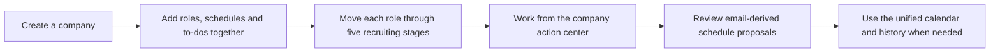
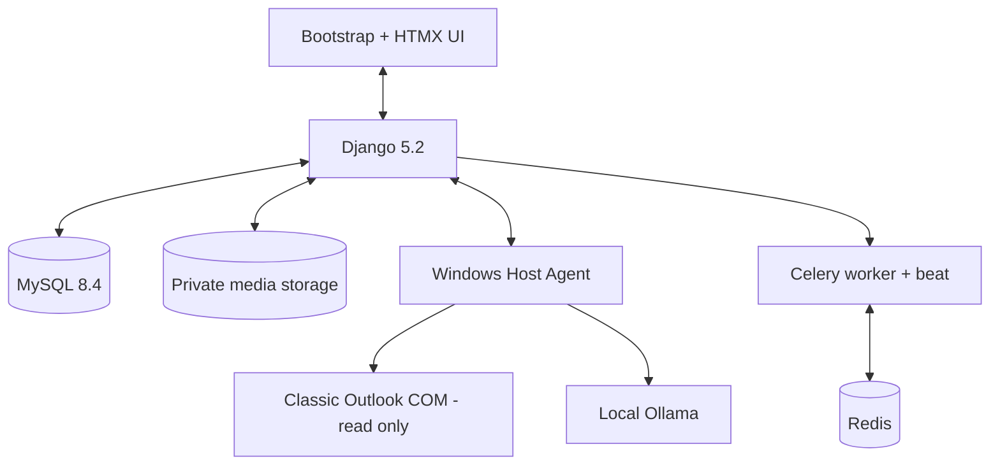
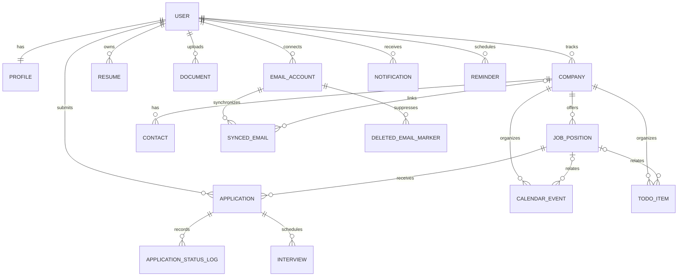

<div align="center">

# Job Tracker

### A private, self-hosted workspace for a focused job search

Track companies, roles, applications, interviews, follow-ups, documents, contacts, and recruitment email in one Django application.

[](https://www.djangoproject.com/)
[](https://www.python.org/)
[](https://www.mysql.com/)
[](#quality-and-security)

</div>

## Workflow



## Highlights

- Company-first action center with pinned ordering, next-action sorting, schedules, and to-dos
- One transactional form can create a company, multiple roles, calendar events, and tasks
- Five-stage Japanese recruiting workflow: research, ES/application, interviews, and final outcome
- Company and position research with status, priority, salary, work mode, and deadlines
- Application list and HTMX board with atomic status history
- Interview planning, calendar events, in-app notifications, and email reminders
- Versioned resumes, private documents, contacts, communications, and tags
- Read-only classic Outlook synchronization on Windows—no Azure account or mailbox password required
- Local-first AI for structured JD parsing and explainable resume-to-job matching
- AI email action proposals: extract dates, meetings, interviews, resume submissions, assessments, forms, replies, and deadlines for user review

### Safe local email management

- Search and paginate synchronized messages
- Link email to a company, application, or contact
- Read plain-text content inside Job Tracker
- Import selected attachments into the private document library
- Delete only the MySQL copy; Outlook messages are never changed
- Preserve linked messages while bounding unlinked storage to 180 days and 1,000 messages per mailbox

## Architecture



| App | Responsibility |
| --- | --- |
| `accounts` | Custom user model, authentication, and profile preferences |
| `companies` | Companies and job openings |
| `applications` | Applications, status history, and interviews |
| `productivity` | Contacts, resumes, documents, communications, and tags |
| `core` | Dashboard, calendar, notifications, and reminders |
| `mailboxes` | Local Outlook sync, retention, linking, reading, and attachment import |
| `ai_assistant` | Ollama/OpenAI providers, JD extraction, matching, email schedule and To Do proposals, consent, and task history |

## Data Model



Field-level details and deletion rules are documented in [`docs/data-model.md`](docs/data-model.md).

## Quick Start on Windows

Requirements: Python 3.12+, PowerShell, MySQL 8.0.11+, and classic Outlook for local mail sync. Redis is optional for continuously scheduled reminders.

```powershell
git clone https://github.com/anous341256/job-tracker.git
cd job-tracker
python -m venv .venv
.\.venv\Scripts\python.exe -m pip install -r requirements.txt
Copy-Item .env.example .env
.\.venv\Scripts\python.exe manage.py migrate
.\.venv\Scripts\python.exe manage.py createsuperuser
.\.venv\Scripts\python.exe manage.py runserver
```

Open [http://127.0.0.1:8000/](http://127.0.0.1:8000/). PowerShell activation is optional; calling the virtual-environment Python directly avoids execution-policy issues.

For the configured local workspace, `powershell -ExecutionPolicy Bypass -File .\scripts\start-all.ps1` starts MySQL, portable Ollama, the Celery worker and beat, and Django.

The current Windows workspace uses a project-local filesystem Celery broker and portable Ollama, so no Redis or C-drive installation is required. See [`docs/ai-assistant.md`](docs/ai-assistant.md).

## Docker Compose Development Mode

The Docker setup packages the repeatable service stack while keeping Windows-only integrations on the host:

- Containerized: Django web, MySQL 8.4, Redis 7, Celery worker, and Celery beat.
- Host-only: classic Outlook COM sync and Ollama. Outlook COM requires the Windows desktop session and is disabled inside Linux containers.

```powershell
Copy-Item .env.docker.example .env.docker
powershell -ExecutionPolicy Bypass -File .\scripts\docker-up.ps1
```

Open [http://127.0.0.1:8000/](http://127.0.0.1:8000/). The first run builds the Python image, starts MySQL and Redis, runs migrations, and collects static files.

Useful commands:

```powershell
docker compose ps
docker compose logs -f web
docker compose exec web python manage.py createsuperuser
powershell -ExecutionPolicy Bypass -File .\scripts\docker-down.ps1
```

Docker volumes hold MySQL, Redis, uploaded media, and collected static files. To reset the container database, run `docker compose down -v`; this deletes Docker-managed data but does not touch Outlook or the project source files.

### Windows Host Agent (Docker mode)

Docker cannot access classic Outlook COM or a loopback-only Ollama instance. The project-local host agent runs in Windows, while the Docker application sends it authenticated work requests. No Outlook or Ollama port is exposed to the network.

```powershell
# Run once after Docker is up; this creates a local token under .local and starts the agent.
powershell -ExecutionPolicy Bypass -File .\scripts\start-host-agent.ps1

# Optional: start automatically after you log in to Windows.
powershell -ExecutionPolicy Bypass -File .\scripts\install-host-agent-autostart.ps1
```

The mailbox and AI settings pages show the helper heartbeat. Keep classic Outlook signed in. For local AI, start Ollama with the existing `scripts\start-ollama.ps1`; Ollama remains bound to `127.0.0.1:11434` and the host agent is the only component that calls it.

#### Relay Outlook to a remote server

The same agent can poll a remote Job Tracker deployment. It never opens a port on the Windows computer: it claims work and uploads bounded email pages through outbound HTTPS requests.

```powershell
# Run on the Windows computer that already has classic Outlook signed in.
powershell -ExecutionPolicy Bypass -File .\scripts\configure-host-agent.ps1 `
  -ServerUrl "https://jobs.example.com"
powershell -ExecutionPolicy Bypass -File .\scripts\start-host-agent.ps1
```

Copy the value in `.local\host-agent\token` to the server's private environment as `HOST_AGENT_TOKEN`. Never commit or paste that value into a public terminal log. Set these values on the server:

```dotenv
HOST_AGENT_ENABLED=True
HOST_AGENT_TOKEN=<same-random-token>
HOST_AGENT_AUTO_SYNC_MINUTES=2
HOST_AGENT_ALLOW_INSECURE_LOCAL=False
TRUST_PROXY_HTTPS=True
```

Remote plain HTTP is rejected. Put Django behind an HTTPS reverse proxy, expose only port 443, and keep MySQL, Redis, Docker, and remote desktop ports private. The proxy must overwrite `X-Forwarded-Proto`; only then enable `TRUST_PROXY_HTTPS`.

The server queues a sync every two minutes by default. Each response is capped at 100 messages and older pages are queued automatically. Outlook EntryID remains unique per mailbox, so retries do not duplicate mail. Before upload, each result is written to `.local\host-agent\outbox` with Windows DPAPI encryption; a connection failure is retried after the server returns. Logs rotate under `.local\host-agent\logs` and contain no bearer token or full prompt.

### AI schedule and To Do proposals from email

After a read-only Outlook sync, likely action messages can be sent to the local `qwen3:8b` model. The model returns separate structured schedule and To Do candidates, including deadlines, action links, evidence, and confidence. Candidates must be reviewed before they can create an interview, calendar event, or To Do. No Outlook message is changed and no candidate is automatically approved.

The built-in **AI → Qwen Mail Assistant** workbench provides a three-pane review flow: pending mail, the current message, and a local Qwen conversation with editable candidate cards. Each conversation is limited to one email, uses at most the latest ten turns, and sends only bounded text through the authenticated Windows Host Agent. A user must explicitly approve every candidate before Job Tracker creates an interview, calendar event, or To Do; “no action” is also an explicit human decision.

Automatic analysis of newly imported messages is controlled by **AI settings → New-mail schedule and To Do extraction**. For an existing local mailbox, a bounded backfill can be queued without touching Outlook:

```powershell
docker compose exec web python manage.py analyze_email_schedules --user-id 1 --limit 10 --provider ollama
```

The command only creates review tasks (maximum 20 per invocation); it does not approve candidates or write to the calendar.

## Outlook Read-only Sync

Sign in to classic Outlook, start the Host Agent in the same Windows desktop session, then open **Email → Email accounts and sync**. Manual sync remains available. When `HOST_AGENT_AUTO_SYNC_MINUTES` is greater than zero, the server also queues read-only sync automatically. Set it to `0` to return to manual-only behavior. Job Tracker never sends, deletes, marks as read, or otherwise modifies Outlook content.

## Background Tasks

```powershell
.\scripts\start-worker.ps1
.\scripts\start-beat.ps1
```

The worker uses `--pool=solo` for Windows. Development email uses Django's console backend, so verification and reminder messages appear in the terminal.

## Quality and Security

```powershell
.\.venv\Scripts\python.exe manage.py makemigrations --check --dry-run
.\.venv\Scripts\python.exe manage.py check
.\.venv\Scripts\python.exe manage.py test --keepdb
```

- Every business queryset is scoped to the signed-in user.
- Downloads verify ownership before returning private files.
- `.env`, local MySQL files, media, tokens, and mailbox content are excluded from Git.
- This is a development project; review deployment settings before exposing it to the internet.
