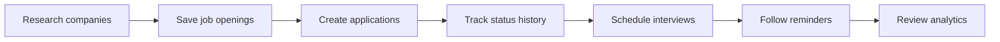
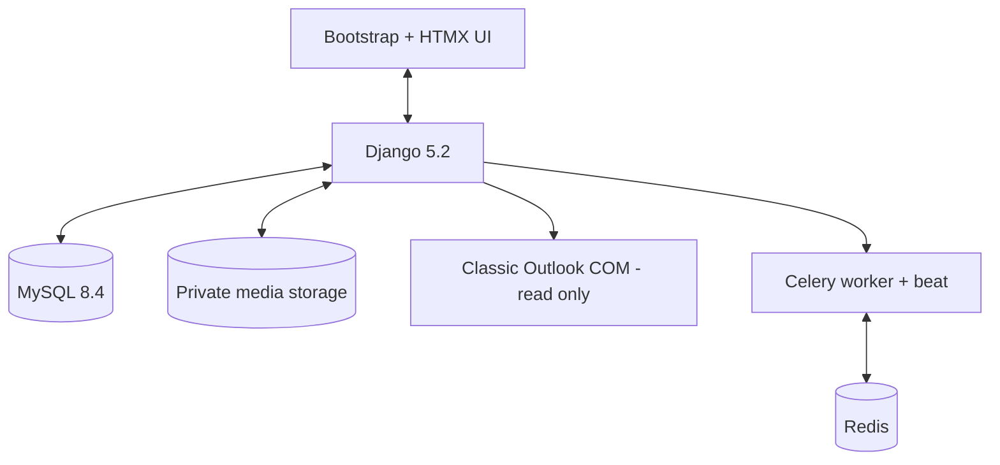
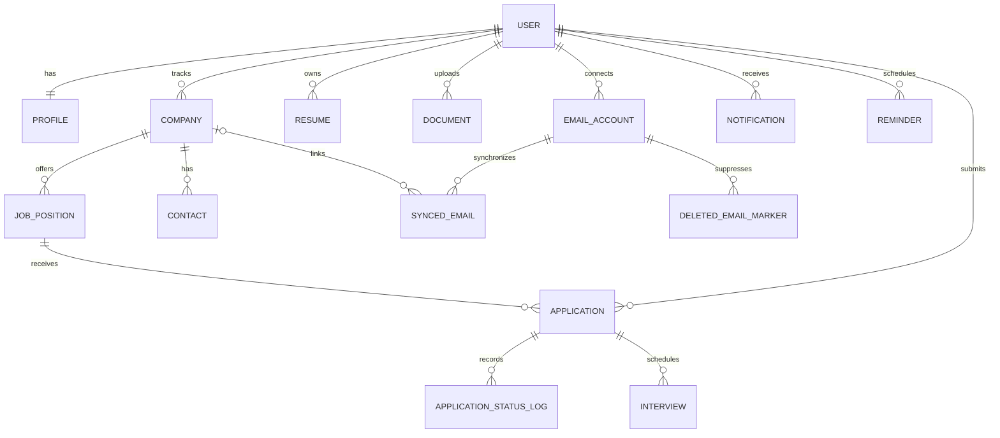

<div align="center">

# Job Tracker

### A private, self-hosted workspace for a focused job search

Track companies, roles, applications, interviews, follow-ups, documents, contacts, and recruitment email in one Django application.

[](https://www.djangoproject.com/)
[](https://www.python.org/)
[](https://www.mysql.com/)
[](#quality-and-security)

</div>

## Workflow



## Highlights

- Company and position research with status, priority, salary, work mode, and deadlines
- Application list and HTMX board with atomic status history
- Interview planning, calendar events, in-app notifications, and email reminders
- Versioned resumes, private documents, contacts, communications, and tags
- Dashboard analytics for sources, monthly trends, conversion, and stage duration
- Read-only classic Outlook synchronization on Windows—no Azure account or mailbox password required

### Safe local email management

- Search and paginate synchronized messages
- Link email to a company, application, or contact
- Read plain-text content inside Job Tracker
- Import selected attachments into the private document library
- Delete only the MySQL copy; Outlook messages are never changed
- Preserve linked messages while bounding unlinked storage to 180 days and 1,000 messages per mailbox

## Architecture



| App | Responsibility |
| --- | --- |
| `accounts` | Custom user model, authentication, and profile preferences |
| `companies` | Companies and job openings |
| `applications` | Applications, status history, and interviews |
| `productivity` | Contacts, resumes, documents, communications, and tags |
| `core` | Dashboard, calendar, notifications, and reminders |
| `mailboxes` | Local Outlook sync, retention, linking, reading, and attachment import |

## Data Model



Field-level details and deletion rules are documented in [`docs/data-model.md`](docs/data-model.md).

## Quick Start on Windows

Requirements: Python 3.12+, PowerShell, MySQL 8.0.11+, and classic Outlook for local mail sync. Redis is optional for continuously scheduled reminders.

```powershell
git clone https://github.com/anous341256/job-tracker.git
cd job-tracker
python -m venv .venv
.\.venv\Scripts\python.exe -m pip install -r requirements.txt
Copy-Item .env.example .env
.\.venv\Scripts\python.exe manage.py migrate
.\.venv\Scripts\python.exe manage.py createsuperuser
.\.venv\Scripts\python.exe manage.py runserver
```

Open [http://127.0.0.1:8000/](http://127.0.0.1:8000/). PowerShell activation is optional; calling the virtual-environment Python directly avoids execution-policy issues.

For the configured local workspace, `powershell -ExecutionPolicy Bypass -File .\scripts\start-all.ps1` starts MySQL and Django, plus Celery when Redis is available.

## Outlook Read-only Sync

Sign in to classic Outlook, run Django in the same Windows desktop session, then open **Email → Email accounts and sync**. Sync is deliberately manual. Job Tracker never sends, deletes, marks as read, or otherwise modifies Outlook content.

## Background Tasks

```powershell
.\scripts\start-worker.ps1
.\scripts\start-beat.ps1
```

The worker uses `--pool=solo` for Windows. Development email uses Django's console backend, so verification and reminder messages appear in the terminal.

## Quality and Security

```powershell
.\.venv\Scripts\python.exe manage.py makemigrations --check --dry-run
.\.venv\Scripts\python.exe manage.py check
.\.venv\Scripts\python.exe manage.py test --keepdb
```

- Every business queryset is scoped to the signed-in user.
- Downloads verify ownership before returning private files.
- `.env`, local MySQL files, media, tokens, and mailbox content are excluded from Git.
- This is a development project; review deployment settings before exposing it to the internet.
